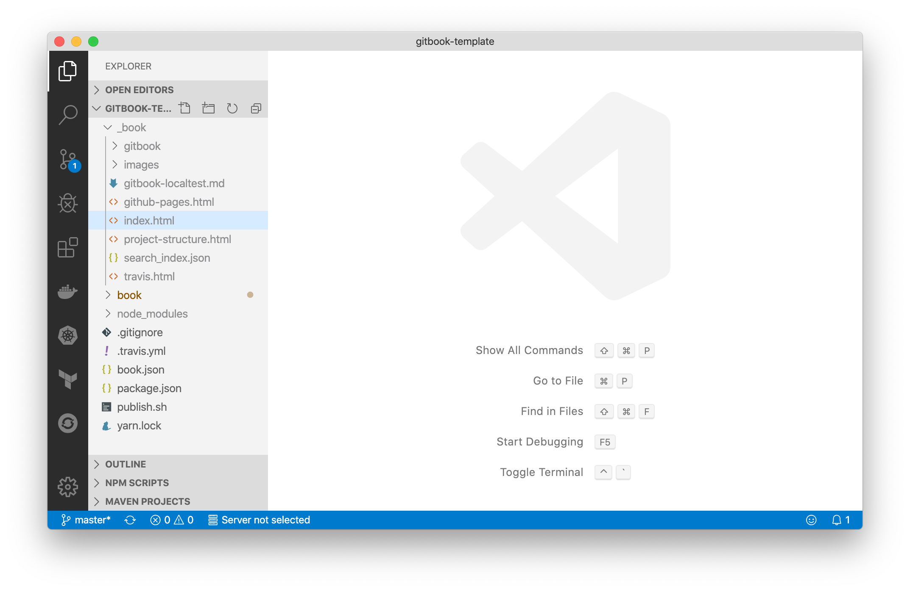

# Test your Gitbook locally


1. First, run yarn to install node_modules

    ```sh
    yarn
    ```

1. Next, run ./publish.sh

    ```sh
    ./publish.sh
    ````

    It creates a folder _book.

1. Open the static `index.html` file under the folder _book

    