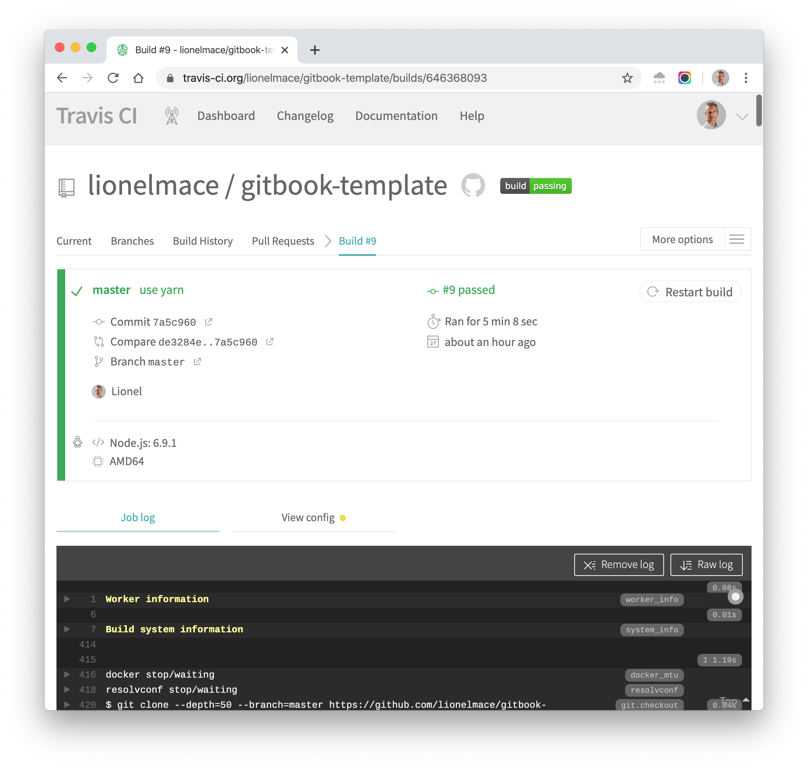
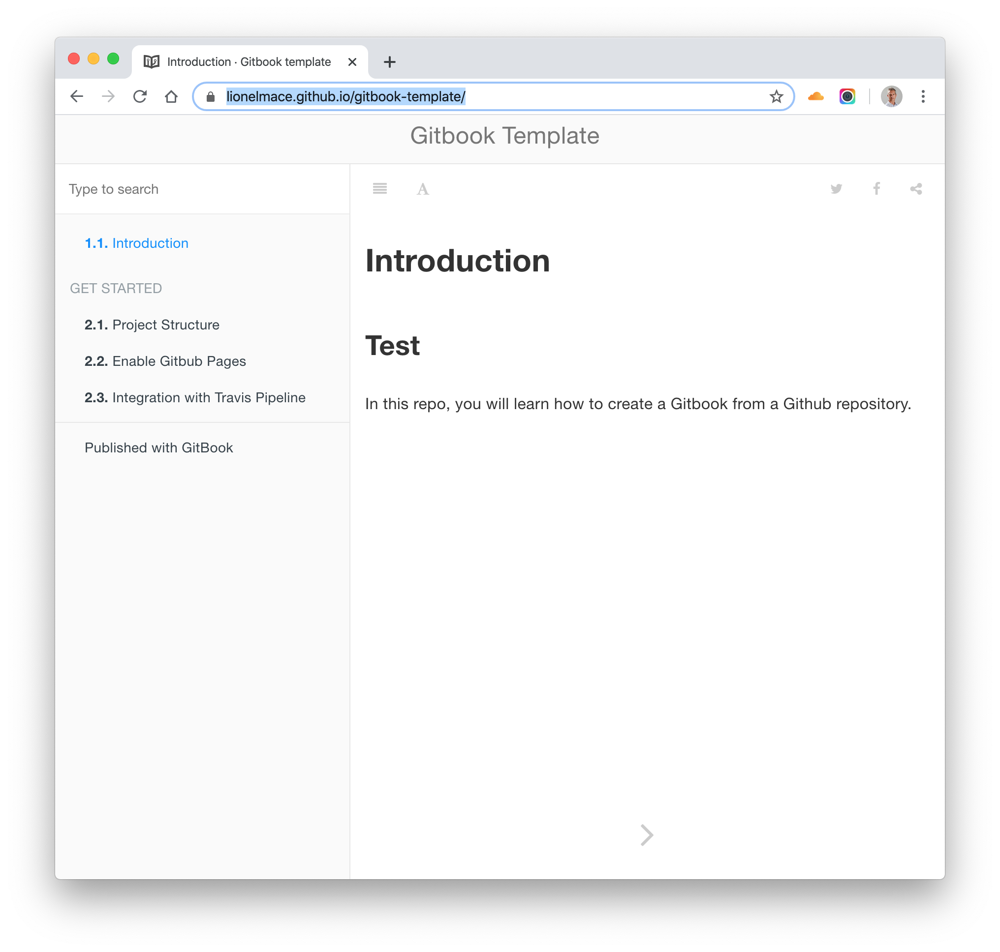

# Publish Book

1. Commit and push your changes. A pipeline is triggered.

    

1. One the book is published, it is available at [https://lionelmace.github.io/gitbook-template/](https://lionelmace.github.io/gitbook-template/)

    