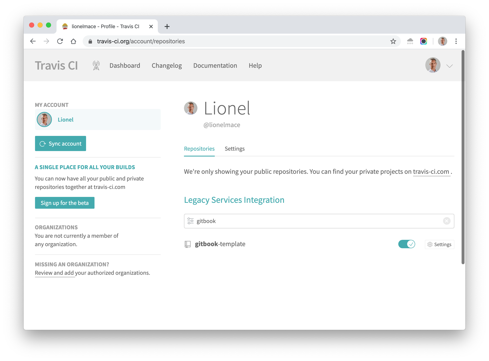
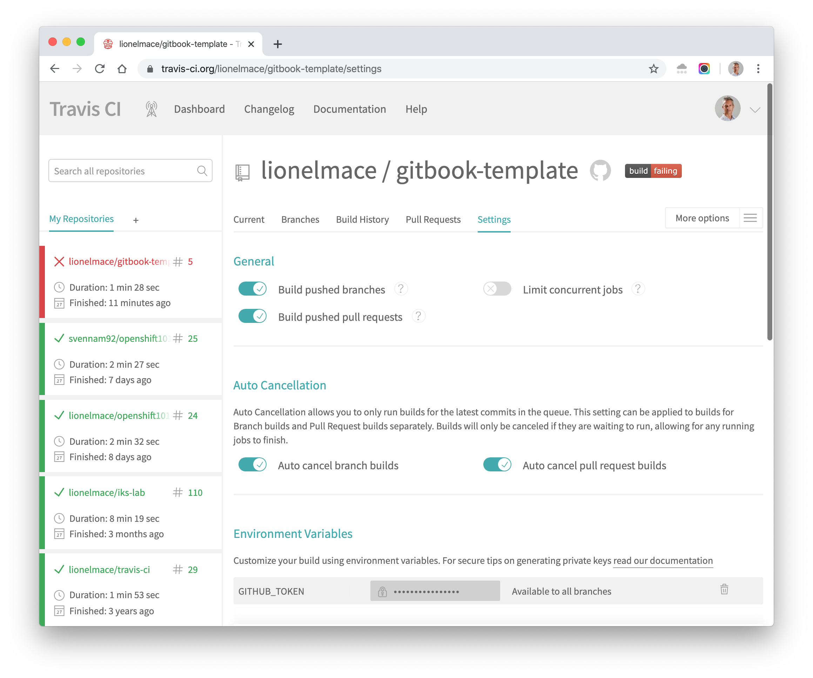

# Integration with Travis Pipeline

1. Go to the **Setting** on your profile in  [Travis CI](https://travis-ci.org/account/repositories)

1. Hit **Sync account** if you do not see the repo in the list

1. Activate the repo

    

1. Go to the **Settings** of the project and add the environment variable `GITHUB_TOKEN`

    